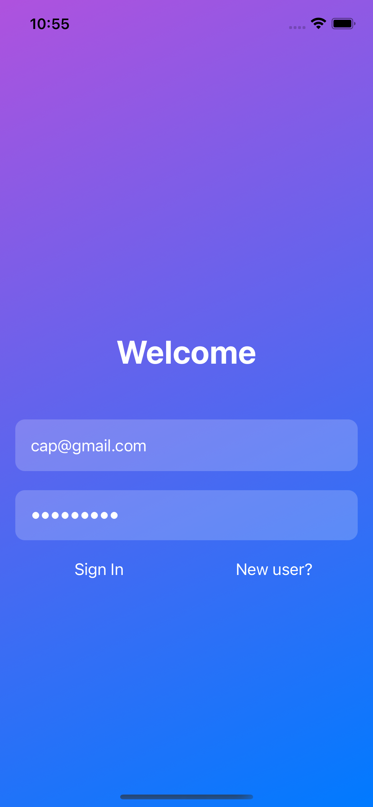
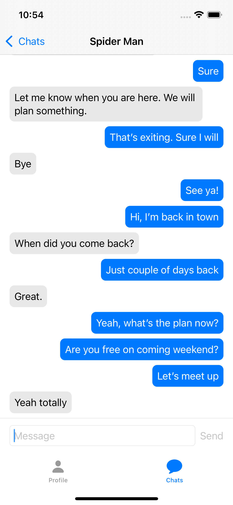
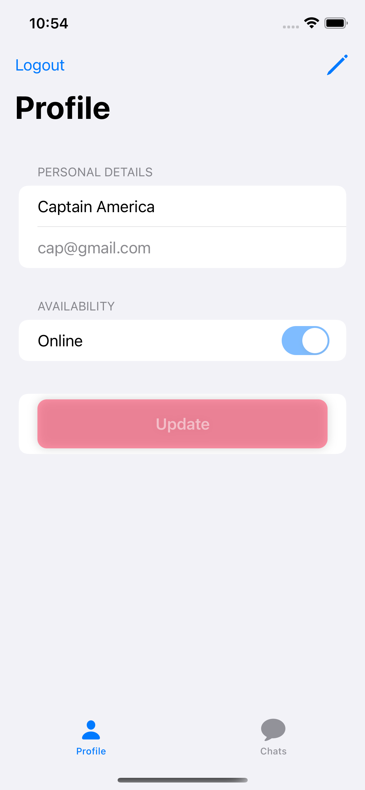
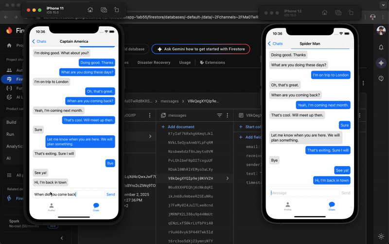

# SwiftUI Firebase Chat App 💬

A real-time iOS chat application built with **SwiftUI** and **MVVM architecture**, powered by **Firebase Firestore**.

## ✨ Features
- 1-to-1 real-time messaging
- Firebase Firestore real-time listeners
- Firebase Authentication
- Modern Swift Concurrency (`async/await`)
- Clean MVVM architecture

## 🛠️ Tech Stack
- **SwiftUI** for UI
- **MVVM** for architecture
- **Firebase Firestore** for chat data
- **Firebase Authentication** for user management
- **Combine / @StateObject** for reactive state

# 📸 Screenshots

### Login Screen

### Chat Screen

### Profile Screen

### Demo (VIDEO)

1️⃣ Clone the Repository
git clone https://github.com/puneet2591/ChatApp.git
cd SwiftUI-Firebase-ChatApp

2️⃣ Open the Project

Launch Xcode (latest stable version recommended).

Open the .xcodeproj or .xcworkspace file.

3️⃣ Configure Firebase

Go to the Firebase Console
 and create a new project.

Enable the following services:

Authentication (Email/Password or your preferred method)

Cloud Firestore (in test mode for development)

Download the GoogleService-Info.plist file.

Add it to the root of your Xcode project (drag & drop into the Project Navigator).

⚠️ Do not commit this file to GitHub — it contains private credentials.

4️⃣ Run the App 🚀

Select a simulator or connect a real iOS device.

Press Run (⌘R) in Xcode.

Create two accounts to test real-time messaging between users.